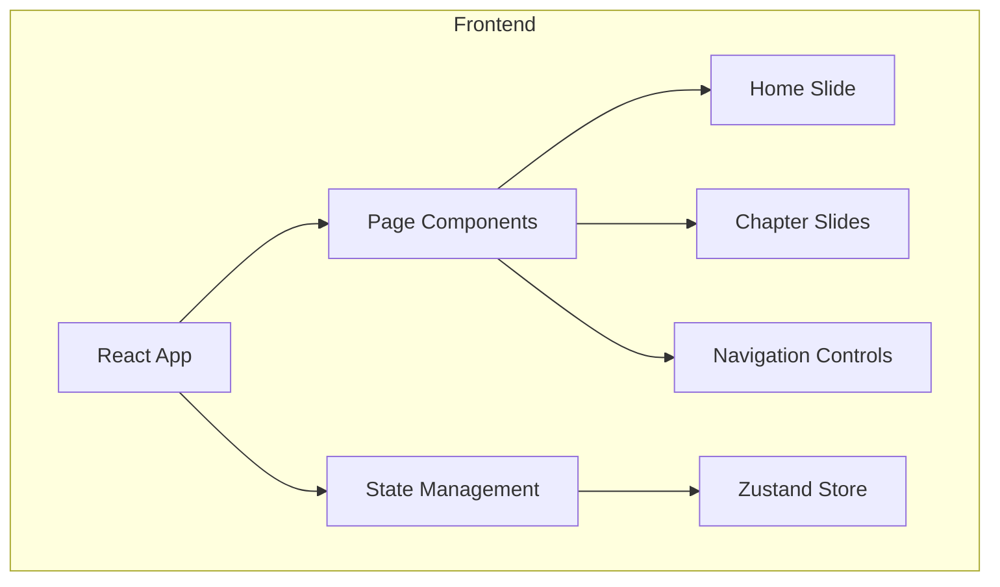

## 1. Architecture Design
采用纯前端架构，使用 React 组件化开发，通过 Zustand 管理页面状态，实现交互式 PPT 展示功能。



## 2. Technology Description
- Frontend: React@18 + TypeScript + Tailwind CSS@3 + Vite
- Initialization Tool: vite-init
- Backend: None (纯前端应用)
- State Management: Zustand

## 3. Route Definitions
| Route | Purpose |
|-------|---------|
| / | 首页（同时也是 PPT 展示页面） |

## 4. Data Model
### 4.1 Slide 数据结构
```typescript
interface Slide {
  id: number;
  title: string;
  type: 'intro' | 'chapter' | 'conclusion';
  content: {
    headings?: string[];
    points?: string[];
    examples?: Array<{
      title: string;
      description: string;
      metrics?: string;
    }>;
  };
}
```

### 4.2 初始幻灯片数据
包含以下章节内容：
1. 首页 - 课程介绍
2. 第一部分：引言
3. 板块1：数据在线化
4. 板块2：过程智能化
5. 板块3：数据驱动决策
6. 第三部分：未来规划
7. 第四部分：总结与答疑
