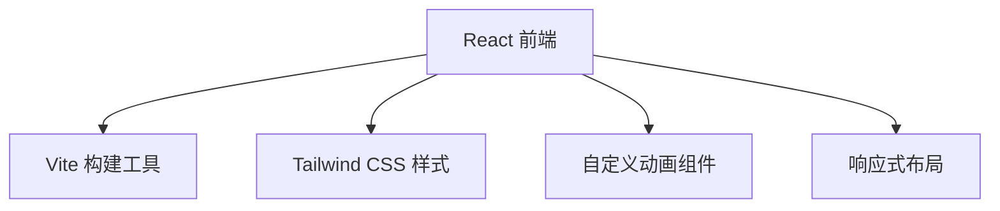

## 1. Architecture Design


## 2. Technology Description
- Frontend: React@18 + tailwindcss@3 + vite
- Initialization Tool: vite-init
- Backend: None
- Database: None

## 3. Route Definitions
| Route | Purpose |
|-------|---------|
| / | 主页面 |

## 4. API Definitions
无后端API

## 5. File Structure
```
/workspace
├── src/
│   ├── components/
│   │   ├── Hero.tsx          # 主视觉组件
│   │   ├── Section.tsx       # 意境篇章组件
│   │   └── Footer.tsx      # 页脚组件
│   ├── App.tsx             # 主应用组件
│   └── main.tsx            # 入口文件
├── .trae/
│   └── documents/
│       ├── prd.md
│       └── arch.md
├── index.html
├── package.json
├── tsconfig.json
├── vite.config.ts
├── tailwind.config.js
└── postcss.config.js
```

## 6. 核心组件设计

### 6.1 Hero 组件
- 全屏高度的主视觉区域
- Canvas粒子动画背景
- 文字分字渐显动画
- 向下滚动引导

### 6.2 Section 组件
- 意境展示卡片
- 视差滚动效果
- 图片懒加载

### 6.3 Footer 组件
- 简约留白设计
