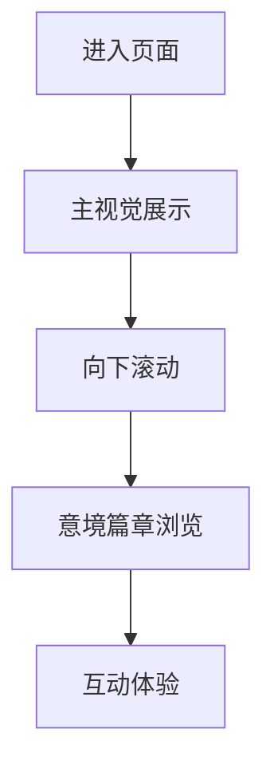

## 1. Product Overview
这是一个沉浸式的演示网页，展示在温泉中舞剑的意境，追求行云流畅、逍遥自在的视觉体验。
- 为用户提供一场视觉盛宴，融合东方美学与现代设计
- 通过优雅的动效和精美的设计，传递出宁静与力量并存的艺术感

## 2. Core Features

### 2.1 Feature Module
1. **主视觉页**: 全屏沉浸式展示，动态背景，核心文案
2. **意境篇章**: 分章节展示不同角度的舞剑意境
3. **互动体验**: 平滑滚动动画，响应式交互效果

### 2.3 Page Details
| Page Name | Module Name | Feature description |
|-----------|-------------|---------------------|
| 主视觉页 | 全屏Hero | 动态背景效果，主标题渐显，向下引导动画 |
| 意境篇章 | 章节展示 | 图片与文字的优雅组合，视差滚动效果 |
| 互动体验 | 滚动动画 | 元素随滚动渐入，平滑过渡效果 |

## 3. Core Process
用户进入页面 → 欣赏主视觉动画 → 向下滚动浏览意境篇章 → 感受互动效果

## 4. User Interface Design
### 4.1 Design Style
- 主色调：深蓝色、暖金色、水墨灰
- 按钮风格：圆角、渐变色、悬停发光效果
- 字体：优雅的宋体风格 + 现代无衬线字体
- 布局风格：全屏沉浸式，留白充足
- 图标风格：简约线条，东方美学

### 4.2 Page Design Overview
| Page Name | Module Name | UI Elements |
|-----------|-------------|-------------|
| 主视觉页 | Hero section | 动态粒子背景，大标题分字渐显，暖金色强调 |
| 意境篇章 | 章节卡片 | 半透明卡片，文字排版精致，视差效果 |
| 页脚 | 底部设计 | 简约留白，意境留白 |

### 4.3 Responsiveness
桌面端优先，移动端自适应优化，触摸体验流畅

### 4.4 视觉特效
- 粒子动画背景
- 文字渐显动画
- 滚动视差效果
- 平滑过渡动画
