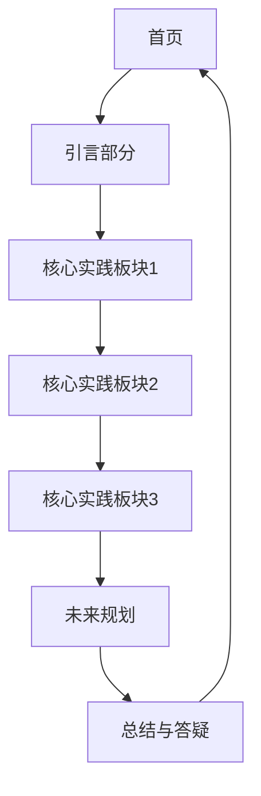

## 1. Product Overview
智能化应用课程 PPT 展示页面，用于展示"智能化在安全管理中的应用——博迈科2024-2025年的探索与实践"课程内容。
- 目标是创建一个交互式的 PPT 展示网页，包含完整的课程大纲、分章节内容展示、优雅的动画效果
- 提供良好的视觉体验和易用的导航功能

## 2. Core Features

### 2.1 Feature Module
1. **PPT 首页**: 标题展示、课程介绍、导航按钮
2. **章节展示页**: 分章节展示课程内容（引言、三大核心实践、未来规划、总结）
3. **导航控制**: 上一页/下一页按钮、章节选择器、进度指示

### 2.2 Page Details
| Page Name | Module Name | Feature description |
|-----------|-------------|---------------------|
| PPT 首页 | Hero section | 大标题展示、课程主题介绍、开始按钮 |
| 章节展示页 | 内容卡片 | 各章节内容展示，包含标题、要点列表、图片占位 |
| 导航控制 | 控制栏 | 上一页/下一页按钮、页码显示、快速跳转 |

## 3. Core Process
用户打开页面 → 看到首页介绍 → 点击开始或使用导航按钮查看各章节 → 通过导航栏快速跳转 → 完成所有章节查看

## 4. User Interface Design
### 4.1 Design Style
- Primary colors: 深蓝色 (#1e3a8a)、浅蓝色 (#3b82f6)
- Secondary accent colors: 科技绿 (#10b981)
- Button style: 圆角、渐变色、悬停效果
- Font: Inter 字体，清晰易读，标题使用粗体
- Layout style: 全屏卡片式布局，居中展示
- Icon style: 简约的线性图标，科技感

### 4.2 Page Design Overview
| Page Name | Module Name | UI Elements |
|-----------|-------------|-------------|
| PPT 首页 | Hero section | 渐变背景、大标题、副标题、开始按钮、居中布局 |
| 章节展示页 | 内容卡片 | 白色卡片、阴影效果、结构化布局、滚动展示 |
| 导航控制 | 控制栏 | 固定在底部、半透明背景、圆角按钮 |

### 4.3 Responsiveness
- Desktop-first 设计，16:9 比例适配
- 支持移动端自适应布局
- 触摸友好的按钮大小

### 4.4 Visual Effects
- 页面切换动画
- 元素淡入效果
- 悬停状态反馈
- 进度指示动画
